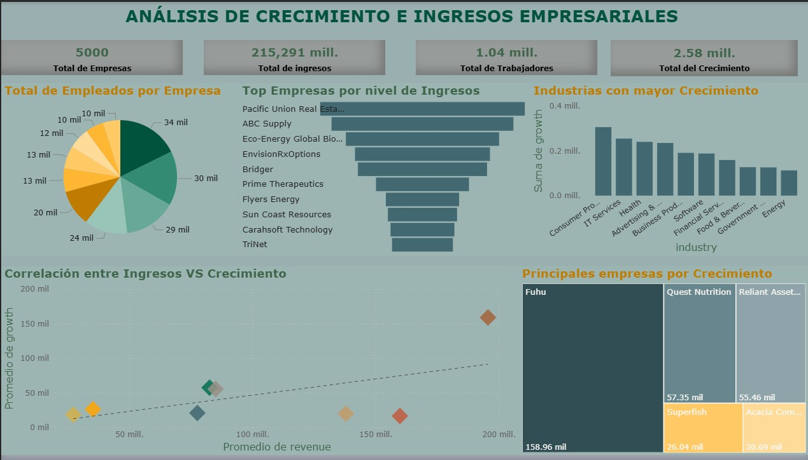

# Dashboard-crecimiento-empresarial
Dashboard de análisis de crecimiento e ingresos empresariales en Power BI

🎯 Preguntas que responde este análisis
¿Qué empresas generan mayores ingresos?
¿Qué industrias presentan mayor crecimiento?
¿Existe correlación entre ingresos y crecimiento empresarial?
¿Cómo se distribuye el tamaño de las empresas por número de empleados?

📈 Hallazgos Clave

Consumer Products e IT Services lideran como las industrias con mayor crecimiento acumulado.
Pacific Union Real Estate y ABC Supply encabezan el ranking de empresas por nivel de ingresos.
El gráfico de dispersión Ingresos vs. Crecimiento revela una correlación positiva moderada: empresas con ingresos superiores a $150 mill. tienden a mostrar crecimientos por encima de la media.
Fuhu destaca como la empresa con mayor crecimiento absoluto (158.96 mil), superando significativamente a sus competidoras más cercanas.
El total de ingresos del universo analizado asciende a $215,291 millones, con un crecimiento agregado de $2.58 millones.

🛠️ Herramientas utilizadas
HerramientaUsoPower BI DesktopDesarrollo del dashboard e visualizacionesExcel / CSVLimpieza y preparación de datosDAXMedidas calculadas y KPIs.

📊 Visualizaciones incluidas
KPIs principales: Total de empresas, ingresos, trabajadores y crecimiento
Gráfico de pastel: Distribución de empleados por empresa
Gráfico de barras horizontal: Top 10 empresas por ingresos
Gráfico de barras vertical: Industrias con mayor crecimiento
Dispersión (Scatter plot): Correlación entre ingresos y crecimiento
Treemap: Principales empresas por crecimiento

🚀 Cómo usar este proyecto

Descarga el archivo Proyecto_final.pbix

Ábrelo con Power BI Desktop (gratuito)

Explora los filtros interactivos para segmentar por industria o empresa

👤 Autor
Ibrain Osbaldo Blancas Noriega

Economista | Analisis de Datos | Business Intelligence
